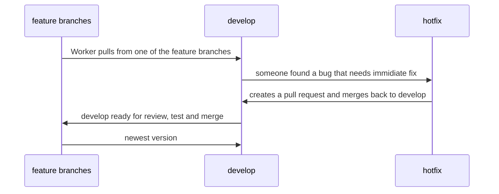

# Simon says

## create an array with colors for your button

## Create a way that checks the state of if the game is started or not

## click listener 

### man just watch a video how simon says works idk man 

### btw solution has jquery so just replace the selectors with how you know it

